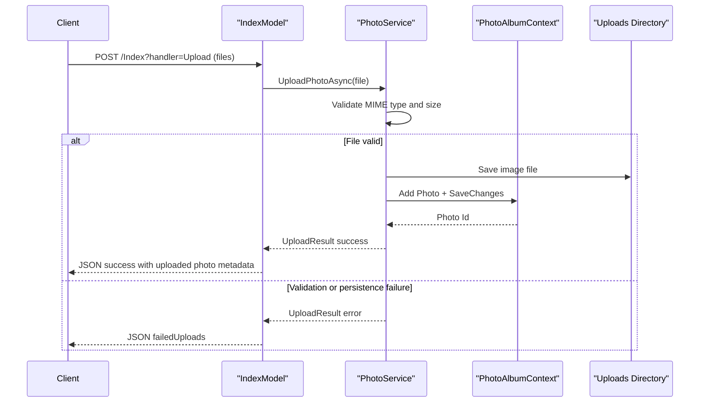

# API & Service Communication Contracts

PhotoAlbum exposes a Razor Pages surface with page handlers that process uploads, detail retrieval, file serving, and deletion. Communication is fully synchronous in-process calls from handlers to a scoped service and then to EF Core/filesystem.

## Service Catalog

| Service | Port | Category | Purpose |
|---|---:|---|---|
| PhotoAlbum web app | 5000/5001 (runtime default ASP.NET Core ports) | API Layer + Business | Serves gallery UI, upload/delete handlers, and photo file retrieval |

## API Endpoints Inventory

| Service | Method | Path | Request Type | Response Type |
|---|---|---|---|---|
| PhotoAlbum | GET | `/Index` | Query params (none required) | Razor page with photo list |
| PhotoAlbum | POST | `/Index?handler=Upload` | `List<IFormFile>` multipart form | JSON payload with `uploadedPhotos` and `failedUploads` |
| PhotoAlbum | GET | `/Detail?id={id}` | Path/query id | Razor page with single photo details |
| PhotoAlbum | POST | `/Detail?handler=Delete&id={id}` | Form/body id | Redirect to `/Index` |
| PhotoAlbum | GET | `/PhotoFile?id={id}` | Query id | Binary file response with image MIME type |

## Management & Observability Endpoints

| Service | Endpoint | Custom Metrics (if any) |
|---|---|---|
| PhotoAlbum | Not explicitly configured (`/health`, `/swagger`, actuator-like endpoints absent) | None detected |

## DTOs & Contracts

The application primarily uses Razor PageModels and entity-backed responses. Request contracts include `List<IFormFile>` for uploads and `int` identifiers for photo retrieval/deletion handlers. Response contracts include anonymous JSON payloads for upload status and file stream responses for image retrieval. The domain entity class used in API/page interactions is `Photo`. No OpenAPI/Swagger document, protobuf schema, or GraphQL schema is present.

## Communication Patterns

All calls are synchronous: client browser to Razor Page handlers, then in-process service calls to `PhotoService`, EF Core SQL operations, and filesystem access for binary image content. No asynchronous messaging or service-to-service calls are configured. No circuit breaker/retry library is configured for external calls. Service discovery and API gateway patterns are not used. Security posture: HTTPS redirection is enabled; explicit authentication and authorization policies are not configured, so handlers are publicly accessible.

## Service Technology Matrix

| Service | Web | Data Access | Discovery | Gateway | Actuator | Cache | Metrics |
|---|---|---|---|---|---|---|---|
| PhotoAlbum | Razor Pages | EF Core + SQL Server + filesystem | None | None | No | Static file HTTP cache headers | No explicit metrics exporter |

## Service Communication Sequence

