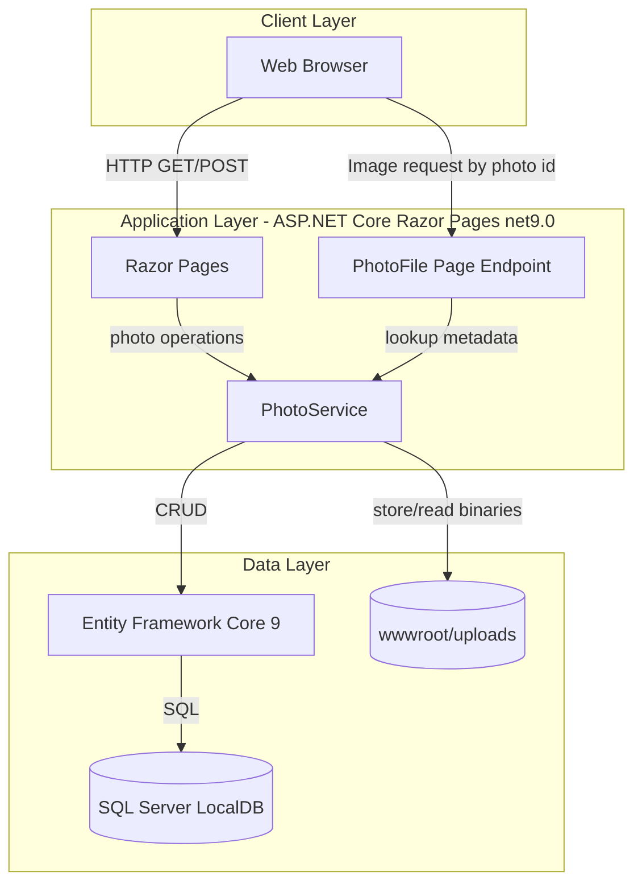
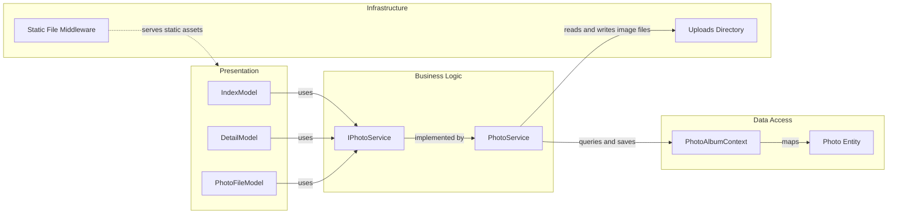

# Architecture Diagram

This document summarizes the PhotoAlbum application architecture and the key runtime component interactions.

## Application Architecture

### Technology Stack Summary

| Layer | Technology | Version | Purpose |
|---|---|---|---|
| Presentation | ASP.NET Core Razor Pages | 9.0 (target framework net9.0) | UI pages and handlers for gallery operations |
| Business Logic | PhotoService | In-repo service | File validation, metadata extraction, persistence orchestration |
| Data Access | Entity Framework Core SQL Server provider | 9.0.9 | ORM and DB persistence |
| File Processing | SixLabors.ImageSharp | 3.1.11 | Image dimension extraction |
| Data Storage | SQL Server LocalDB + local filesystem | Configured in appsettings | Metadata in DB, image binaries in uploads folder |

### Data Storage & External Services

The app stores photo metadata in SQL Server LocalDB through EF Core and stores image binaries on local disk under `wwwroot/uploads`. No external SaaS APIs, queues, or message brokers are configured.

### Key Architectural Decisions

- Uses a service abstraction (`IPhotoService`) to isolate page handlers from storage/persistence details.
- Uses hybrid storage: relational DB for metadata and filesystem for photo content.
- Applies EF Core migrations on startup (except when `IsTestEnvironment=true`) to keep schema aligned.

## Component Relationships

### Component Inventory

| Component | Layer | Type | Responsibility |
|---|---|---|---|
| IndexModel | Presentation | Razor PageModel | Lists photos and handles upload requests |
| DetailModel | Presentation | Razor PageModel | Shows photo detail and handles delete action |
| PhotoFileModel | Presentation | Razor PageModel | Serves photo bytes by logical photo id |
| IPhotoService | Business Logic | Service contract | Defines photo operations |
| PhotoService | Business Logic | Service implementation | Validates uploads, persists metadata, manages files |
| PhotoAlbumContext | Data Access | EF Core DbContext | Provides `Photos` DbSet and model configuration |
| Photo | Data Access | Entity | Stores photo metadata |
