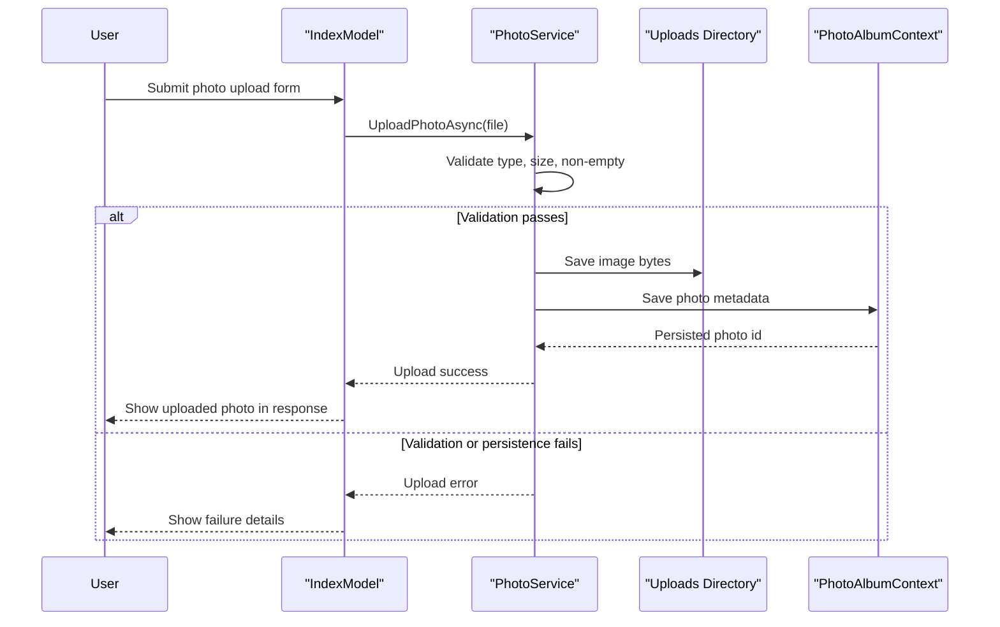

# Core Business Workflows

The application’s business domain is photo gallery management: users upload, browse, view, and delete photos while the system maintains metadata and stored image content.

## Domain Entities

| Entity | Service / Bounded Context | Description | Key Relationships |
|---|---|---|---|
| Photo | Photo Management | Represents a stored image and its metadata | Referenced by gallery listing, detail view, file serving, and delete workflow |

## Service-to-Domain Mapping

| Service | Domain Context | Owned Entities | External Dependencies |
|---|---|---|---|
| PhotoAlbum | Photo Management | Photo | SQL Server metadata store, local uploads directory |

## Primary Workflows

### Workflow 1: Upload Photos to Gallery

1. User submits one or more files from the gallery page upload UI.
2. Upload handler validates request presence and iterates files.
3. Service validates MIME type and maximum size, then generates unique stored filename.
4. Service extracts image dimensions when possible, writes file to uploads directory, and persists metadata.
5. Handler returns JSON with successful and failed upload items.

Business rules involved: allowed image MIME types, max file size, non-empty file requirement, rollback file deletion when DB persistence fails.

### Workflow 2: Browse and View Photo Details

1. User opens gallery page.
2. Application loads photos ordered newest-first.
3. User opens a detail view for one photo id.
4. Application resolves previous/next navigation candidates from the same ordered set.

Business rules involved: only existing photo ids resolve to detail view; missing ids return not found.

### Workflow 3: Delete Photo

1. User triggers delete on detail page.
2. Service finds photo metadata record.
3. Service attempts filesystem deletion, then removes DB record.
4. User is redirected to gallery page.

Business rules involved: if file delete fails, metadata deletion still proceeds; missing photo id results in graceful false path.

## Cross-Service Data Flows

The solution is single-service; there are no inter-service REST/event aggregation flows. Data composition occurs inside one service boundary by combining DB metadata with filesystem-stored image content.

## Business Workflow Sequence

## Business Rules & Decision Logic

- Upload accepts only configured image MIME types and rejects unsupported types.
- Upload enforces max-size and non-empty file constraints.
- Metadata persistence is attempted only after filesystem write; failed DB write triggers file rollback attempt.
- Detail and file retrieval return not found for invalid/missing ids.
- Delete workflow prioritizes metadata consistency: DB delete proceeds even if filesystem deletion fails.
