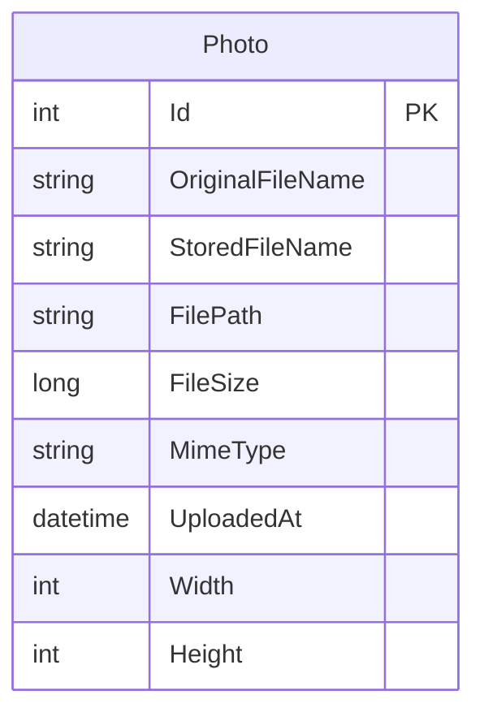

# Data Architecture & Persistence Layer

The data layer centers on a single EF Core DbContext and one aggregate (`Photo`) persisted to SQL Server LocalDB, with photo binary content stored on local disk.

## Database Configuration

| Service/Module | DB Type | Profile | Driver | Connection | Migration Tool |
|---|---|---|---|---|---|
| PhotoAlbum | SQL Server LocalDB | Default (`appsettings.json`) | EF Core SqlServer provider | LocalDB connection string in configuration | EF Core Migrations (`Database.MigrateAsync`) |
| PhotoAlbum.Tests | EF Core InMemory | Test runtime | EF Core InMemory provider | In-memory provider options | None (in-memory schema) |

## Data Ownership per Service

| Service | Tables Owned | ORM Framework | Caching | Notes |
|---|---|---|---|---|
| PhotoAlbum | `Photos` | Entity Framework Core | None at data layer | Metadata in DB; file bytes stored in uploads folder |

## Entity Model

## Key Repository Methods

| Service | Repository | Notable Methods | Purpose |
|---|---|---|---|
| PhotoAlbum | `PhotoAlbumContext` (`DbSet<Photo>`) | `FindAsync(id)` | Lookup photo metadata by primary key |
| PhotoAlbum | `PhotoAlbumContext` (`DbSet<Photo>`) | `OrderByDescending(p => p.UploadedAt).ToListAsync()` | Gallery listing in reverse chronological order |
| PhotoAlbum | `PhotoAlbumContext` (`DbSet<Photo>`) | `AddAsync(photo)` + `SaveChangesAsync()` | Persist uploaded photo metadata |
| PhotoAlbum | `PhotoAlbumContext` (`DbSet<Photo>`) | `Remove(photo)` + `SaveChangesAsync()` | Delete photo metadata |

## Caching Strategy

The persistence layer does not define Redis/memory query caches. Caching is limited to HTTP static response headers for files, while EF Core queries execute directly against the database.

## Data Ownership Boundaries

The application is a single-service system with one relational store for metadata and one local filesystem location for binary content. Cross-service data access does not apply because there are no separate deployable data-owning services.

### Data Classification & Sensitivity

| Entity | Sensitive Fields | Classification (PII/PHI/PCI/None) | Controls in Place |
|---|---|---|---|
| Photo | `OriginalFileName` may include personal names or identifiers | PII (potential) | No explicit field-level encryption or masking configured in code |

No PHI or PCI-specific entity data was detected.
