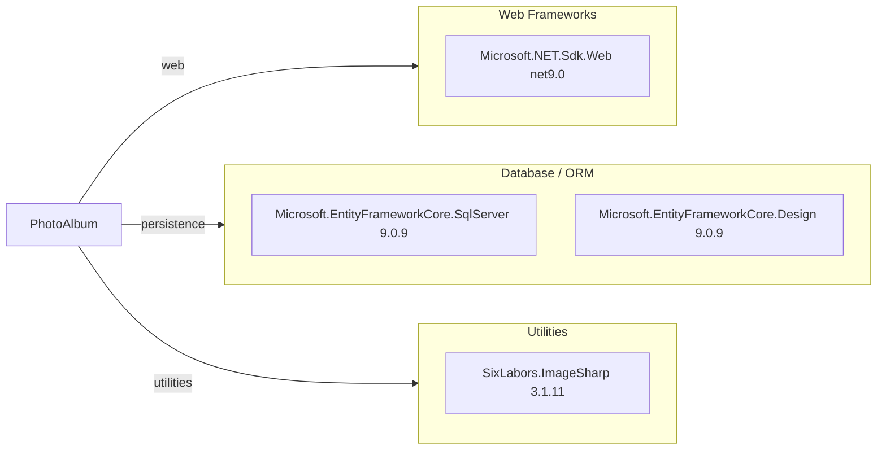

# Dependency Map

This map summarizes declared external dependencies for PhotoAlbum and groups them by functional category.

## Dependencies

### Dependency Summary

| Category | Count | Key Libraries | Notes |
|---|---:|---|---|
| Web Frameworks | 1 | Microsoft.NET.Sdk.Web | Razor Pages app runtime |
| Database / ORM | 2 | EF Core SqlServer, EF Core Design | SQL Server persistence and tooling |
| Utilities | 1 | SixLabors.ImageSharp | Image metadata extraction |

### Version & Compatibility Risks

The project targets `net9.0`, which is modern and compatible with EF Core 9 packages used here. Assessment findings should still be reviewed for migration blockers related to platform/runtime targets and any API usage changes when moving to a newer target.

### Notable Observations

- Dependency footprint in production code is small and focused.
- EF Core Design is correctly marked with private assets in the application project.
- No dedicated observability or resiliency libraries are declared.

## Test Dependencies

| Framework | Version | Notes |
|---|---|---|
| xUnit | 2.9.2 | Unit/integration test framework |
| Microsoft.NET.Test.Sdk | 17.12.0 | Test host/runtime |
| Microsoft.AspNetCore.Mvc.Testing | 9.0.9 | Web app integration testing |
| Microsoft.EntityFrameworkCore.InMemory | 9.0.9 | In-memory DB test support |
| coverlet.collector | 6.0.2 | Coverage collection |

Total test-scope dependencies: 6

The test stack is standard for ASP.NET Core applications and includes both web-host integration and in-memory persistence support.
