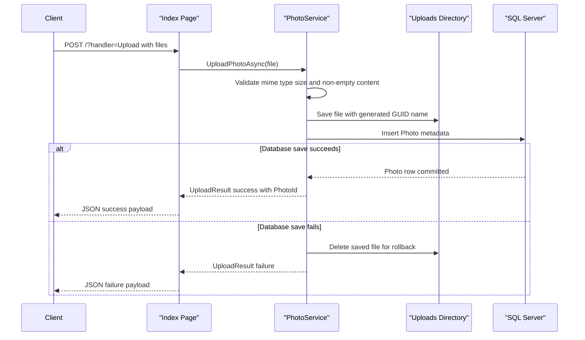

# API & Service Communication Contracts

PhotoAlbum exposes a small HTTP surface through Razor Pages rather than conventional API controllers. Communication is entirely synchronous and in-process: browser requests are handled by page handlers that call a scoped photo service and return HTML, file content, or JSON.

## Service Catalog

| Service | Port | Category | Purpose |
|---|---|---|---|
| PhotoAlbum | 5134 HTTP, 7055 HTTPS in development, 8080 in container image | API Layer | Serves the gallery UI, accepts uploads, renders photo details, and streams image files |

## API Endpoints Inventory

| Service | Method | Path | Request Type | Response Type |
|---|---|---|---|---|
| PhotoAlbum | GET | `/` | None | Razor Page containing gallery items from `List<Photo>` |
| PhotoAlbum | POST | `/?handler=Upload` | Multipart form data `List<IFormFile>` | JSON object containing `success`, uploaded photo summaries, and failed upload details |
| PhotoAlbum | GET | `/Detail/{id?}` | Path or query parameter `id` | Razor Page bound to `Photo` plus navigation identifiers |
| PhotoAlbum | POST | `/Detail/{id}?handler=Delete` | Path or query parameter `id` with antiforgery form post | Redirect to `/Index` or redirect back to detail with `TempData` error |
| PhotoAlbum | GET | `/photo/{id:int}` | Path parameter `id` | Binary file response with `photo.MimeType` content type |
| PhotoAlbum | GET | `/Privacy` | None | Razor Page |
| PhotoAlbum | GET | `/Error` | None | Razor Page |

## Management & Observability Endpoints

| Service | Endpoint | Custom Metrics (if any) |
|---|---|---|
| PhotoAlbum | None discovered | No custom metrics or management endpoints detected |

## DTOs & Contracts

The application does not define a separate public REST DTO layer. Its API contracts are composed of:

- `Photo` as the service-level domain entity used to back gallery and detail page rendering.
- `UploadResult` as an internal service contract that reports upload success, created identifier, original filename, and user-facing error message.
- Anonymous JSON response payloads from `OnPostUploadAsync`, which return a success flag plus `uploadedPhotos` and `failedUploads` collections.

No gateway-level aggregation DTOs, OpenAPI documents, protobuf schemas, or GraphQL schemas were found. Serialization for JSON responses is handled by the default ASP.NET Core JSON stack, and all currently observed request/response models are mutable classes rather than C# records.

## Communication Patterns

All request handling is synchronous and local to one process. Browser requests reach Razor Page handlers, which invoke `IPhotoService` directly through dependency injection. The service persists metadata through EF Core and performs file I/O against the local uploads directory.

No asynchronous messaging, background event processing, gRPC, service discovery, API gateway, retry policy, circuit breaker, timeout policy, or client-side load balancing was found. Startup availability depends on the SQL Server connection being usable because EF Core migrations run during application startup.

At the API contract level, HTTPS redirection is enabled and the development profile exposes both HTTP and HTTPS ports. However, no authentication services, login flow, JWT/OAuth configuration, role checks, or authorization policies were found, so all page endpoints are effectively publicly accessible.

## Service Technology Matrix

| Service | Web | Data Access | Discovery | Gateway | Actuator | Cache | Metrics |
|---|---|---|---|---|---|---|---|
| PhotoAlbum | Razor Pages | EF Core SQL Server | None | No | None | None | None detected |

## Service Communication Sequence

