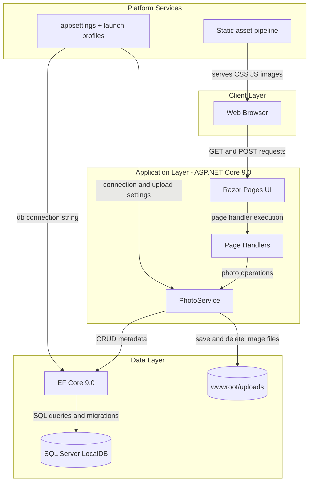
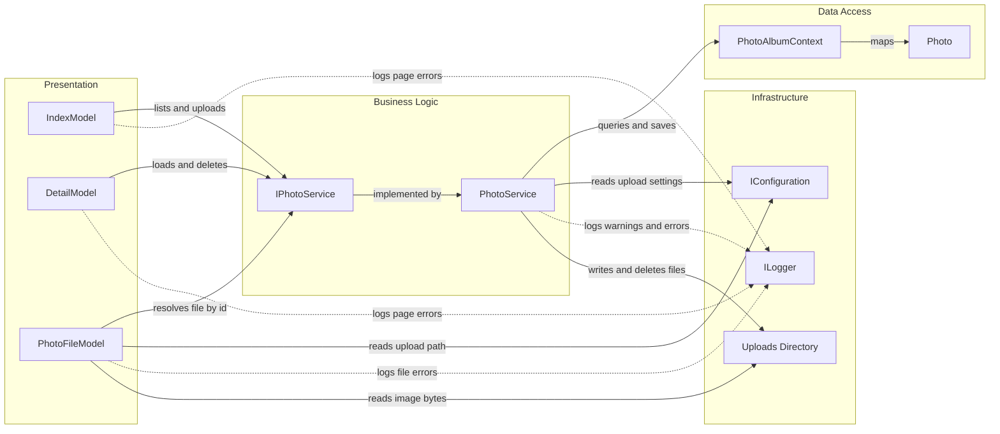

# Architecture Diagram

PhotoAlbum is a single ASP.NET Core Razor Pages application that combines presentation, business logic, persistence, and file storage inside one deployable web app. The application centers on photo upload, gallery display, and file retrieval workflows backed by SQL Server metadata storage.

## Application Architecture

### Technology Stack Summary

| Layer | Technology | Version | Purpose |
|---|---|---:|---|
| Presentation | ASP.NET Core Razor Pages | 9.0 | Server-rendered UI for gallery, detail, and upload flows |
| Business Logic | `PhotoService` | Application code | Validates uploads and coordinates file and metadata operations |
| Data Access | Entity Framework Core SQL Server provider | 9.0.9 | Persists photo metadata and applies migrations |
| Data Storage | SQL Server LocalDB | Configured connection | Stores photo metadata such as filenames, mime types, and timestamps |
| File Storage | Local filesystem under `wwwroot/uploads` | N/A | Stores the uploaded image binaries |
| Platform | Docker multi-stage build, static asset pipeline | .NET 9 base images | Packaging and static file delivery |

### Data Storage & External Services

The application uses one relational datastore, SQL Server LocalDB, for photo metadata and a local filesystem directory under `wwwroot/uploads` for the image content itself. No caches, message brokers, third-party APIs, or remote platform services are directly integrated into the runtime path of the current application.

### Key Architectural Decisions

- Uses a single deployable monolith with Razor Pages page handlers delegating business operations to a scoped `IPhotoService`.
- Separates image binaries from relational metadata by storing files on disk and descriptive metadata in SQL Server through EF Core.
- Applies EF Core migrations on startup outside the test environment so schema evolution stays coupled to app startup.

## Component Relationships

### Component Inventory

| Component | Layer | Type | Responsibility |
|---|---|---|---|
| `IndexModel` | Presentation | Razor PageModel | Loads the gallery and handles multipart upload requests |
| `DetailModel` | Presentation | Razor PageModel | Displays one photo, computes navigation, and handles delete requests |
| `PhotoFileModel` | Presentation | Razor PageModel | Serves the stored image bytes by photo identifier |
| `IPhotoService` | Business Logic | Service contract | Defines photo retrieval, upload, and deletion operations |
| `PhotoService` | Business Logic | Scoped service | Validates uploads, extracts metadata, writes files, and persists records |
| `PhotoAlbumContext` | Data Access | EF Core `DbContext` | Owns the `Photos` set and entity configuration |
| `Photo` | Data Access | EF Core entity | Represents stored metadata for one uploaded image |
| `IConfiguration` | Infrastructure | Configuration provider | Supplies connection string and upload settings |
| `ILogger<T>` | Infrastructure | Logging abstraction | Captures diagnostics and failure details |
| `wwwroot/uploads` | Infrastructure | Filesystem store | Holds the physical image content |
