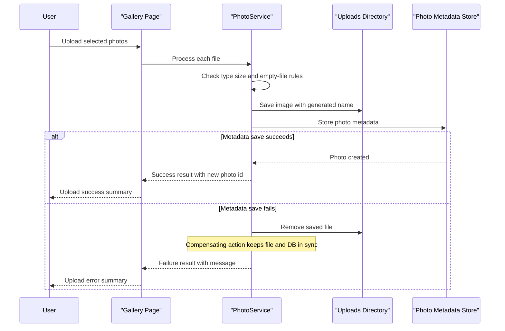

# Core Business Workflows

PhotoAlbum lets users upload, browse, inspect, and remove photos in a simple gallery experience. The domain is centered on photo asset management, with business behavior focused on validation, metadata capture, and keeping filesystem and database state aligned.

## Domain Entities

| Entity | Service / Bounded Context | Description | Key Relationships |
|---|---|---|---|
| `Photo` | Photo Management | Represents one user-uploaded image and its display metadata within the gallery | Displayed in the gallery, detail page, and file-serving workflow |
| `UploadResult` | Upload Processing | Communicates the business outcome of a single upload attempt | Links upload validation and persistence outcomes back to the UI |

## Service-to-Domain Mapping

| Service | Domain Context | Owned Entities | External Dependencies |
|---|---|---|---|
| PhotoAlbum | Photo Management | `Photo`, `UploadResult` | SQL Server metadata store, local uploads directory |

## Primary Workflows

### Workflow 1: Upload photo

1. A user submits one or more image files from the gallery page.
2. `IndexModel` forwards each file to `PhotoService`.
3. `PhotoService` enforces business rules: allowed mime type, non-empty file, and maximum size.
4. The service generates a GUID-based stored filename, optionally extracts image dimensions, and writes the file into the uploads directory.
5. The service saves photo metadata to SQL Server.
6. If metadata persistence fails, the saved file is deleted to keep storage consistent.
7. The page returns a JSON result summarizing successful and failed uploads.

### Workflow 2: Browse gallery and inspect photo details

1. A user opens the gallery page.
2. `IndexModel` requests all photos ordered newest first from `PhotoService`.
3. The gallery renders thumbnails, filenames, upload timestamps, and optional dimensions.
4. When the user opens a specific photo, `DetailModel` loads the same ordered set to locate the selected item and compute previous and next navigation.
5. The detail page shows the image and human-readable metadata.

### Workflow 3: Delete photo

1. A user submits the delete form from the detail page.
2. `DetailModel` calls `PhotoService.DeletePhotoAsync`.
3. The service looks up the photo record, deletes the physical file when present, and then removes the database record.
4. On success, the user is redirected back to the gallery; on failure, the page shows an error message through `TempData`.

## Cross-Service Data Flows

No cross-service or cross-context data composition was found. All business flows stay inside one web application, and data joins happen implicitly inside the same SQL-backed bounded context. There is also no circuit breaker or downstream fallback behavior because the app does not call external services during normal request processing.

## Business Workflow Sequence

## Business Rules & Decision Logic

- Supported upload formats are restricted to JPEG, PNG, GIF, and WebP.
- Each uploaded file must be non-empty and must not exceed the configured 10 MB limit.
- Stored filenames are replaced with GUID-based names so physical file paths are unique regardless of the original filename.
- Image dimension extraction is best-effort: failures do not block the upload if the file can still be saved and persisted.
- Upload persistence uses a compensating action rather than an explicit distributed transaction: if database save fails after file write, the file is deleted.
- Gallery ordering is strictly chronological by `UploadedAt` descending.
- Delete behavior prioritizes removing the physical file but still proceeds with metadata deletion even if file removal logs an error.
- No business-level authorization rules were detected; photo upload, view, and delete actions are publicly reachable.
