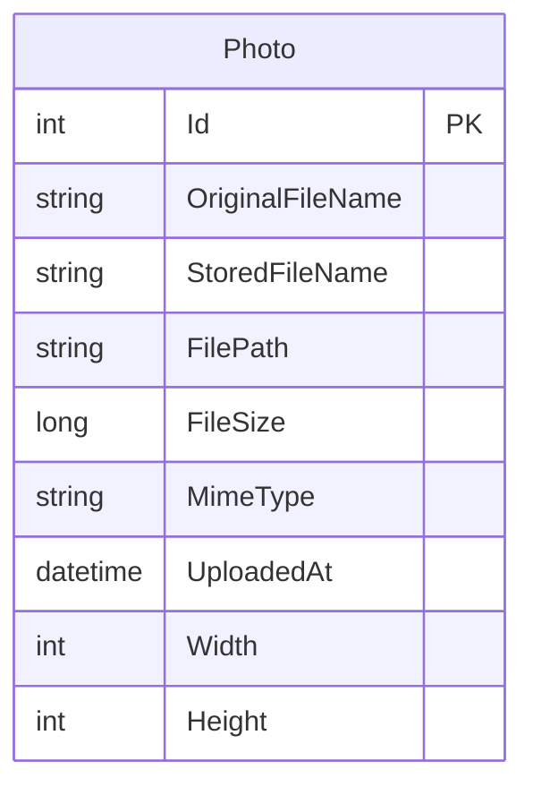

# Data Architecture & Persistence Layer

PhotoAlbum has a simple data layer built around a single EF Core entity and one relational database connection, with uploaded image binaries stored separately on the local filesystem. Persistence concerns are concentrated in one `DbContext` and one service class.

## Database Configuration

| Service/Module | DB Type | Profile | Driver | Connection | Migration Tool |
|---|---|---|---|---|---|
| PhotoAlbum | SQL Server LocalDB | Default and non-test runtime | EF Core SQL Server provider | LocalDB connection string from `appsettings.json` | EF Core migrations executed at startup |
| PhotoAlbum.Tests | EF Core in-memory database | Test | EF Core InMemory provider | Ephemeral per-test database name | None |

## Data Ownership per Service

| Service | Tables Owned | ORM Framework | Caching | Notes |
|---|---|---|---|---|
| PhotoAlbum | `Photos` | Entity Framework Core | None | Single application owns all persisted metadata; image bytes live on disk rather than in the database |

## Entity Model

## Key Repository Methods

| Service | Repository | Notable Methods | Purpose |
|---|---|---|---|
| PhotoAlbum | `PhotoAlbumContext` (`DbSet<Photo>`) | `OrderByDescending(p => p.UploadedAt).ToListAsync()` | Returns gallery results newest first |
| PhotoAlbum | `PhotoAlbumContext` (`DbSet<Photo>`) | `FindAsync(id)` | Retrieves a single photo for detail and file-serving flows |
| PhotoAlbum | `PhotoAlbumContext` (`DbSet<Photo>`) | `AddAsync(photo)` plus `SaveChangesAsync()` | Persists uploaded photo metadata |
| PhotoAlbum | `PhotoAlbumContext` (`DbSet<Photo>`) | `Remove(photo)` plus `SaveChangesAsync()` | Deletes photo metadata after file deletion |

## Caching Strategy

No caching layer was detected. The application reads photo metadata directly from SQL Server through EF Core and reads image bytes directly from the local uploads directory. Browser-side cache headers are applied for static assets and streamed photo files, but there is no server-side cache provider, cache-aside pattern, or distributed cache configuration.

## Data Ownership Boundaries

The current implementation uses a single shared relational database for all persisted metadata and a colocated filesystem directory for the binary content. There are no cross-service ownership boundaries because the repository contains only one deployable application and no external data consumers. Read and write operations are handled synchronously through `PhotoService`, with compensating file deletion used when database persistence fails during upload.

### Data Classification & Sensitivity

| Entity | Sensitive Fields | Classification (PII/PHI/PCI/None) | Controls in Place |
|---|---|---|---|
| `Photo` | `OriginalFileName` may contain user-supplied personal information; referenced image file may contain personal image content outside the database | PII | No explicit encryption-at-rest, masking, or field-level access controls were detected in the application configuration |
