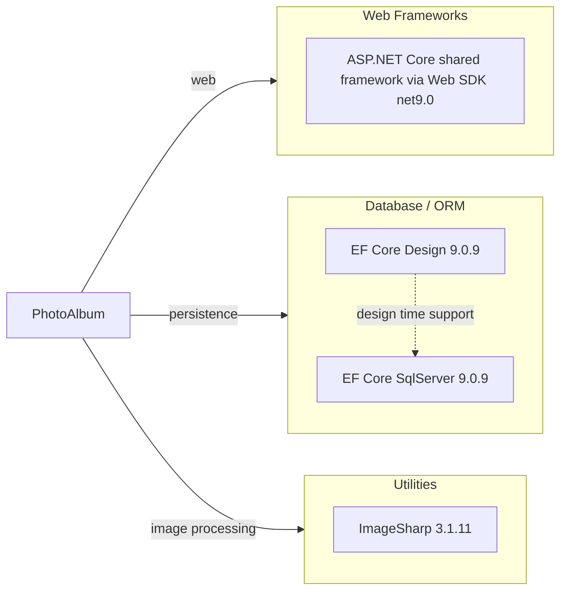

# Dependency Map

PhotoAlbum is a .NET 9 web application with a compact dependency surface centered on ASP.NET Core, Entity Framework Core, and ImageSharp. The build files declare 3 primary runtime dependencies and 5 test-scoped dependencies.

## Dependencies

### Dependency Summary

| Category | Count | Key Libraries | Notes |
|---|---:|---|---|
| Web Frameworks | 1 | ASP.NET Core shared framework | Brought in through `Microsoft.NET.Sdk.Web` rather than explicit package references |
| Database / ORM | 2 | Microsoft.EntityFrameworkCore.SqlServer, Microsoft.EntityFrameworkCore.Design | SQL Server persistence plus migration tooling |
| Utilities | 1 | SixLabors.ImageSharp | Reads uploaded image dimensions before persistence |

### Version & Compatibility Risks

The application targets `net9.0`, which is a short-term support release and will likely require regular forward upgrades compared with an LTS baseline. Entity Framework Core `9.0.9` and the ASP.NET Core shared framework are aligned to the current target, so a future move to `net10.0` will likely need coordinated framework and package version updates rather than isolated library upgrades.

### Notable Observations

- The runtime dependency graph is intentionally small, which should simplify modernization and hosting changes.
- SQL Server support is explicit through `Microsoft.EntityFrameworkCore.SqlServer`, while ASP.NET Core itself is supplied implicitly by the Web SDK.
- `Microsoft.EntityFrameworkCore.Design` is marked as a private asset, so it supports migrations without flowing into consumers.
- No dedicated logging, caching, messaging, or observability packages are declared beyond what the ASP.NET Core shared framework provides.

## Test Dependencies

| Framework | Version | Notes |
|---|---:|---|
| xUnit | 2.9.2 | Primary unit testing framework |
| xUnit runner Visual Studio | 2.8.2 | Test discovery and execution adapter |
| Microsoft.NET.Test.Sdk | 17.12.0 | .NET test host infrastructure |
| Microsoft.AspNetCore.Mvc.Testing | 9.0.9 | Web application test hosting support |
| Microsoft.EntityFrameworkCore.InMemory | 9.0.9 | In-memory database provider for tests |
| coverlet.collector | 6.0.2 | Code coverage collection |

Total test-scope dependencies: 6

The test stack is modern and aligned with the `net9.0` target. Integration support is available through `Microsoft.AspNetCore.Mvc.Testing`, while current checked-in tests focus primarily on the `PhotoService` and use the in-memory EF Core provider.
